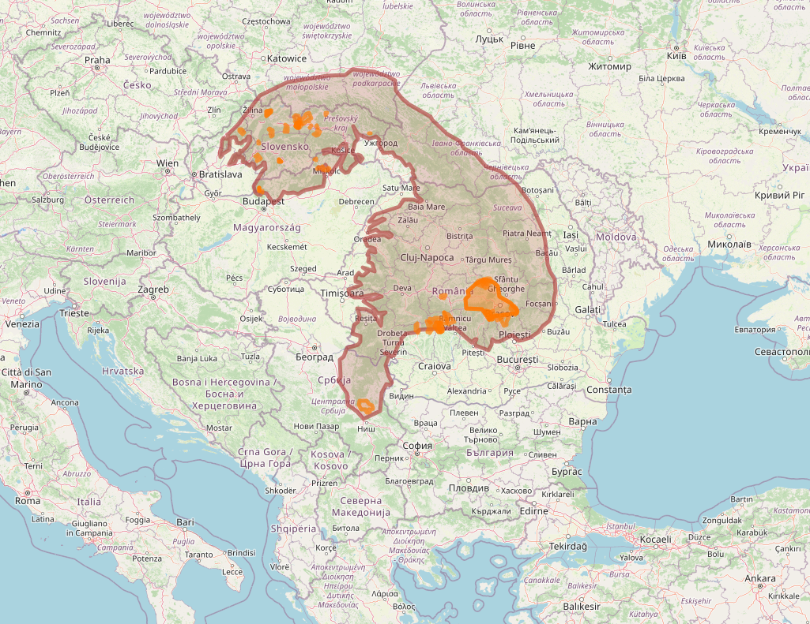
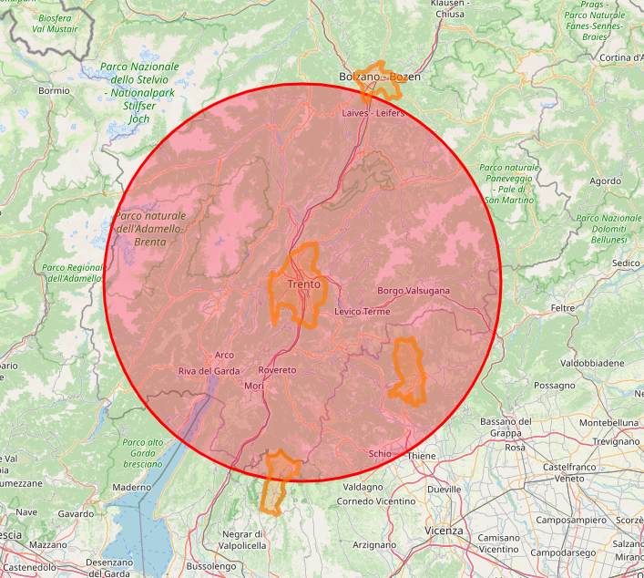

# GeoSPARQL Queries for the Paper "TITLE"

This repository contains the text of the queries and web application that provides comprehensive answers to all the queries presented in the paper "TITLE". The repository is structured to ensure easy navigation and access to specific queries and their respective answers.

## Query 1 (Q1) - Value chains operating in the Carpathian Mountains

```
PREFIX rdfs: <http://www.w3.org/2000/01/rdf-schema#>
PREFIX geof: <http://www.opengis.net/def/function/geosparql/> 
PREFIX geo: <http://www.opengis.net/ont/geosparql#>
PREFIX narra: <https://dlnarratives.eu/ontology#>
PREFIX osm: <https://www.openstreetmap.org/>
PREFIX wd: <http://www.wikidata.org/entity/>
PREFIX osm2rdfkey: <https://osm2rdf.cs.uni-freiburg.de/rdf/key#>

SELECT ?nlabel ?clabel ?wktLau
WHERE {	
    ?narra narra:isAboutCountry ?country ;
           narra:isAboutLAU ?lau ;
    	      rdfs:label ?nlabel .
    ?country rdfs:label ?clabel .
    ?lau geo:hasGeometry ?glau .
    ?glau geo:asWKT ?wktLau . 
    { 
    	SELECT ?wkt WHERE {
        	SERVICE 
      		  <https://qlever.cs.uni-freiburg.de/api/osm-planet> { 
            	?osm_id osm2rdfkey:wikidata wd:Q1288 ;
                        geo:hasGeometry ?geometry .
                ?geometry geo:asWKT ?wkt .
        	} 
    	}
  	}
   FILTER(geof:sfIntersects(?wktLau,?wkt)).
}
```



| nlabel                                                                                                                                              | clabel         |
|-----------------------------------------------------------------------------------------------------------------------------------------------------|----------------|
| ECO-FERTILISER (WOOL PELLETS)                                                                                                                       | Romania        |
| 'DULCEAȚĂ'                                                                                                                                        | Romania        |
| FORESTS WITH SPECIAL PROTECTION FUNCTION                                                                                                            | Romania        |
| In Eastern Serbia/Mountain Rtanj, herb   tea - Saturejea Montana                                                                                    | Serbia         |
| 'BRÂNZĂ DE BURDUF'                                                                                                                                | Romania        |
| Timber production in Slovak mountain   forests                                                                                                      | Slovakia       |
| Milk production with label 'mountain   milk' according to EU regulations                                                                            | Slovakia       |
| Family farms with both production and   recreational possibilities for visitors                                                                     | Slovakia       |
| Horse breeding in mountain areas                                                                                                                    | Slovakia       |
| Organic farming and wine production in   Vadna                                                                                                      | Hungary        |
| Spring and mineral waters from mountains   - sold as natural or flavored with local wild herbs                                                      | Slovakia       |
| Ecological garden in Pallagvölgy - a   joint enterprise                                                                                            | Hungary        |
| HOREZU' CERAMICS                                                                                                                                    | Romania        |
| THERAPEUTIC BEE PRODUCTS (PROPOLIS and   POLLEN)                                                                                                    | Romania        |
| 'MOZZARELLA'                                                                                                                                        | Romania        |
| E-commerce and governement incentives to   support domestic game meat consumption                                                                   | Slovakia       |
| 'TELEMEA'                                                                                                                                           | Romania        |
| Pumpkin seed products in Boldva                                                                                                                     | Hungary        |
| The labelled traditional cheese products   from sheep or from a mixture of sheep and cow milk                                                       | Slovakia       |
| Valašský frgál                                                                                                                                   | Czech Republic |
| A strong alcoholic beverages from juniper   berries growing in Slovak mountains protected by PGI                                                    | Slovakia       |
| Beef cattle breeding in mountains                                                                                                                   | Slovakia       |
| Winter ski recreation in Slovak mountains                                                                                                           | Slovakia       |
| Living Countryhouse - farm museum                                                                                                                   | Hungary        |
| Beekeeping in mountain areas for   different bee products and polination                                                                            | Slovakia       |
| Collection of forest mushrooms for own   consumption                                                                                                | Slovakia       |
| Wood from Slovak forests used for   building houses, cottages, restaurants and guesthouses                                                          | Slovakia       |
| 'SALAM MONTAN ANGUS'                                                                                                                                | Romania        |
| FARMED and PROCESSED MOUNTAIN TROUT                                                                                                                 | Romania        |
| 'BRÄ‚NZÄ‚ HOREZU'                                                                                                                                   | Romania        |
| VIDRA LAKE and LOTRU-CIUNGET   HYDROELECTRIC POWER STATION                                                                                          | Romania        |
| Use of good quality air for healing   purposes through recreational stays in high mountains                                                         | Slovakia       |
| ALL SEASON MOUNTAIN TOURISM                                                                                                                         | Romania        |
| The tastes of Monostor                                                                                                                              | Hungary        |
| Small scale production of high quality   oils for eating and cosmetic purposes                                                                      | Slovakia       |
| Sheep's wool processing helps maintain   traditional sheep farming in Slovakia; the sheep wool products include home   textile products and clothes | Slovakia       |
| Organic production and packaging of   medicinal herbs in mountains                                                                                  | Slovakia       |
| 'PASTRAMA DE OAIE'                                                                                                                                  | Romania        |
| Processed timber (saw mils and wood   products) from domestic production                                                                            | Slovakia       |
| HIGH NATURE VALUE (HNV) GRASSLANDS                                                                                                                  | Romania        |
| Cow - dairy products                                                                                                                                | Czech Republic |
| MOUNTAIN HONEY                                                                                                                                      | Romania        |
| Lamb meat production - focusing on local   consumers instead of export                                                                              | Slovakia       |
| LIVE SHEEP and LAMBS FOR SLAUGHTER                                                                                                                  | Romania        |
| Sustainable local food system project -   Kóspallag                                                                                                | Hungary        |
| Pasta from Múcsony - a social economy   project                                                                                                    | Hungary        |
| CERTIFIED ECOTOURISM                                                                                                                                | Romania        |
| A combination of beekeeping and   agrotourism                                                                                                       | Slovakia       |
| FIREWOOD FOR HEATING and COOKING                                                                                                                    | Romania        |
| 'GASTRO LOCAL'                                                                                                                                      | Romania        |
| Trizs, the fruitful village                                                                                                                         | Hungary        |

## Query 2 (Q2) - Value chains operating around Trento city (Italy)

```
PREFIX uom:  <http://www.opengis.net/def/uom/OGC/1.0/>
PREFIX rdfs:  <http://www.w3.org/2000/01/rdf-schema#>
PREFIX geof:  <http://www.opengis.net/def/function/geosparql/> 
PREFIX geo:  <http://www.opengis.net/ont/geosparql#>
PREFIX narra:  <https://dlnarratives.eu/ontology#>
SELECT ?nlabel ?clabel ?wktLau
WHERE { 
       {
    ?narra narra:isAboutCountry ?country ;
            narra:isAboutLAU ?lau ;
            rdfs:label ?nlabel .
    ?country rdfs:label ?clabel .
    ?lau geo:hasGeometry ?glau .
    ?glau geo:asWKT ?wktLau .
}
    FILTER(geof:sfIntersects(
        ?wktLau,
        geof:buffer(
            "POINT(11.12108 46.06787)"^^geo:wktLiteral,
        0.5, uom:degree))). 
}
```



| nlabel                                                                                               | clabel |
|------------------------------------------------------------------------------------------------------|--------|
| Dairy industry                                                                                       | Italy  |
| La Cattedra- Commons farming for social   and educational purposes- Asiago Plateau                   | Italy  |
| With a open-air grazing in a regional   natural park, it is produced and processed high-quality milk | Italy  |
| Alto Trentino, organic wine production   for premium wines                                           | Italy  |

## Structure of the application

In the folder web-app is possible to find the web application

- index.html
  - This is the main page of the application.
  - It contains an index table listing all the queries from the thesis.
  - Clicking on a row in the table will open the respective page that provides the answer to that query.


## Usage


1. Open the Application:
   - Start by opening the 'index.html' file in your web browser.

2. Navigate to a Query:
   - Browse through the index table to find the query of interest.
   - Click on the row corresponding to the desired query.

3. View the Answer:
   - Upon clicking, you will be redirected to a page that contains the answer to the selected query.


## Files


- index.html: The main index page with a table of all the queries.
- geoQueryVizQ1.html, geoQueryVizQ2.html, geoQueryVizQ3.html, geoQueryVizQ4.html: Individual pages for each query, each displaying a map with the results.


Contact


For any questions or feedback, please contact Nicolò Pratelli at nicolo.pratelli@isti.cnr.it.
