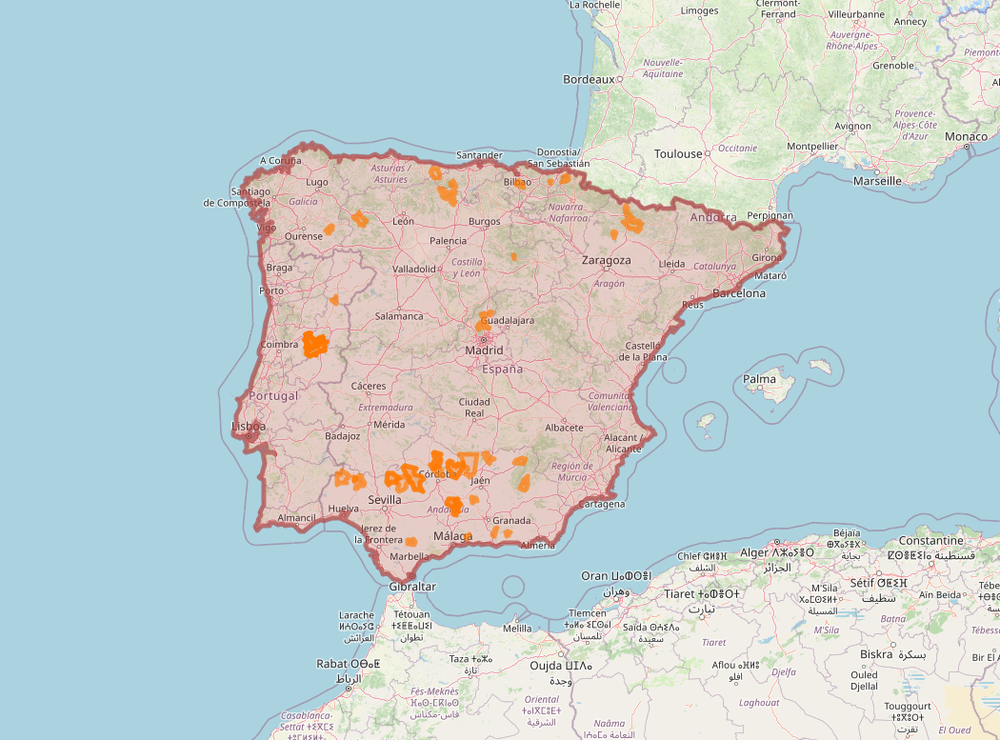
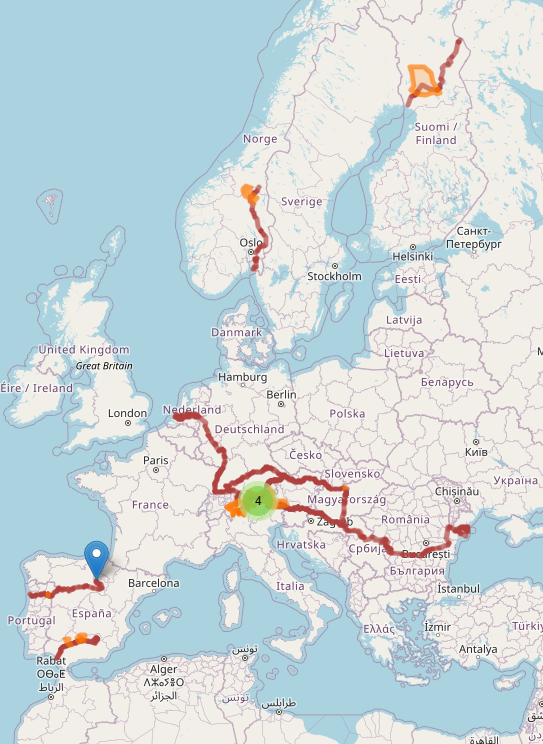

# GeoSPARQL Queries for the Paper "TITLE"

This repository contains the text of the queries and web application that provides comprehensive answers to all the queries presented in the paper "TITLE". The repository is structured to ensure easy navigation and access to specific queries and their respective answers.

## Query 1 (Q1) - Value chains operating in the Carpathian Mountains

```
PREFIX rdfs: <http://www.w3.org/2000/01/rdf-schema#>
PREFIX geof: <http://www.opengis.net/def/function/geosparql/> 
PREFIX geo: <http://www.opengis.net/ont/geosparql#>
PREFIX narra: <https://dlnarratives.eu/ontology#>
PREFIX osm: <https://www.openstreetmap.org/>
PREFIX wd: <http://www.wikidata.org/entity/>
PREFIX osm2rdfkey: <https://osm2rdf.cs.uni-freiburg.de/rdf/key#>

SELECT ?nlabel ?clabel ?wktLau
WHERE {	
    ?narra narra:isAboutCountry ?country ;
           narra:isAboutLAU ?lau ;
    	      rdfs:label ?nlabel .
    ?country rdfs:label ?clabel .
    ?lau geo:hasGeometry ?glau .
    ?glau geo:asWKT ?wktLau . 
    { 
    	SELECT ?wkt WHERE {
        	SERVICE 
      		  <https://qlever.cs.uni-freiburg.de/api/osm-planet> { 
            	?osm_id osm2rdfkey:wikidata wd:Q1288 ;
                        geo:hasGeometry ?geometry .
                ?geometry geo:asWKT ?wkt .
        	} 
    	}
  	}
   FILTER(geof:sfIntersects(?wktLau,?wkt)).
}
```

### Explanaition of the query
The query internally accesses the QLever endpoint provided by the University of Freiburg, specifically utilizing the OpenStreetMap subgraph to define the Carpathian Mountains as a polygonal region.

The `SELECT` statement at line 9 specifies the output variables: `?nlabel` (narrative title), `?clabel` (country name), and `?wktLau` (LAU geometry in WKT format). These variables are the focus of the query’s output. The `WHERE` clause, beginning at line 10, contains the conditions required for each result. The following graph patterns are used:

- At line 12, the triple pattern `?narrative narra:isAboutLAU ?lau` links each narrative to its corresponding LAU.
- At line 15, the triple pattern `?lau geo:hasGeometry ?glau` retrieves the geometry associated with each LAU.
- At line 16, the triple pattern `?glau geo:asWKT ?wktLau` provides the WKT representation of the LAU geometry.


A nested `SELECT` clause, beginning at line 18, retrieves the WKT geometries (`?wkt`) of the Carpathian Mountains region under the following `WHERE` conditions:

- The `SERVICE` keyword is used to access the external QLever endpoint at \url{https://qlever.cs.uni-freiburg.de/api/osm-planet`.
- The triple pattern at line 21, `?osm\_id osm2rdfkey:wikidata wd:Q1286`, retrieves the instance corresponding to the Wikidata entity \textit{Carpathian Mountains` (wd:Q1288).
- The triple pattern at line 22, `?osm\_id geo:geometry ?geometry`, retrieves the IRI representing the geometry of `wd:Q1288` (Carpathian Mountains).
- The triple pattern at line 23, `?geometry geo:asWKT ?wkt`, retrieves the WKT representation of the Carpathian Mountains geometry.


A final `FILTER` clause at line 27 performs an intersection between the LAU and Carpathian Mountains geometries, retrieving all LAU polygons that intersect with the Carpathian Mountains region. The resulting set of LAU can be imported into a GIS visualizer and overlaid with the Carpathian reference region.


### Results of the query


| nlabel                                                                                                                                              | clabel         |
|-----------------------------------------------------------------------------------------------------------------------------------------------------|----------------|
| ECO-FERTILISER (WOOL PELLETS)                                                                                                                       | Romania        |
| 'DULCEAȚĂ'                                                                                                                                        | Romania        |
| FORESTS WITH SPECIAL PROTECTION FUNCTION                                                                                                            | Romania        |
| In Eastern Serbia/Mountain Rtanj, herb   tea - Saturejea Montana                                                                                    | Serbia         |
| 'BRÂNZĂ DE BURDUF'                                                                                                                                | Romania        |
| Timber production in Slovak mountain   forests                                                                                                      | Slovakia       |
| Milk production with label 'mountain   milk' according to EU regulations                                                                            | Slovakia       |
| Family farms with both production and   recreational possibilities for visitors                                                                     | Slovakia       |
| Horse breeding in mountain areas                                                                                                                    | Slovakia       |
| Organic farming and wine production in   Vadna                                                                                                      | Hungary        |
| Spring and mineral waters from mountains   - sold as natural or flavored with local wild herbs                                                      | Slovakia       |
| Ecological garden in Pallagvölgy - a   joint enterprise                                                                                            | Hungary        |
| HOREZU' CERAMICS                                                                                                                                    | Romania        |
| THERAPEUTIC BEE PRODUCTS (PROPOLIS and   POLLEN)                                                                                                    | Romania        |
| 'MOZZARELLA'                                                                                                                                        | Romania        |
| E-commerce and governement incentives to   support domestic game meat consumption                                                                   | Slovakia       |
| 'TELEMEA'                                                                                                                                           | Romania        |
| Pumpkin seed products in Boldva                                                                                                                     | Hungary        |
| The labelled traditional cheese products   from sheep or from a mixture of sheep and cow milk                                                       | Slovakia       |
| Valašský frgál                                                                                                                                   | Czech Republic |
| A strong alcoholic beverages from juniper   berries growing in Slovak mountains protected by PGI                                                    | Slovakia       |
| Beef cattle breeding in mountains                                                                                                                   | Slovakia       |
| Winter ski recreation in Slovak mountains                                                                                                           | Slovakia       |
| Living Countryhouse - farm museum                                                                                                                   | Hungary        |
| Beekeeping in mountain areas for   different bee products and polination                                                                            | Slovakia       |
| Collection of forest mushrooms for own   consumption                                                                                                | Slovakia       |
| Wood from Slovak forests used for   building houses, cottages, restaurants and guesthouses                                                          | Slovakia       |
| 'SALAM MONTAN ANGUS'                                                                                                                                | Romania        |
| FARMED and PROCESSED MOUNTAIN TROUT                                                                                                                 | Romania        |
| 'BRÄ‚NZÄ‚ HOREZU'                                                                                                                                   | Romania        |
| VIDRA LAKE and LOTRU-CIUNGET   HYDROELECTRIC POWER STATION                                                                                          | Romania        |
| Use of good quality air for healing   purposes through recreational stays in high mountains                                                         | Slovakia       |
| ALL SEASON MOUNTAIN TOURISM                                                                                                                         | Romania        |
| The tastes of Monostor                                                                                                                              | Hungary        |
| Small scale production of high quality   oils for eating and cosmetic purposes                                                                      | Slovakia       |
| Sheep's wool processing helps maintain   traditional sheep farming in Slovakia; the sheep wool products include home   textile products and clothes | Slovakia       |
| Organic production and packaging of   medicinal herbs in mountains                                                                                  | Slovakia       |
| 'PASTRAMA DE OAIE'                                                                                                                                  | Romania        |
| Processed timber (saw mils and wood   products) from domestic production                                                                            | Slovakia       |
| HIGH NATURE VALUE (HNV) GRASSLANDS                                                                                                                  | Romania        |
| Cow - dairy products                                                                                                                                | Czech Republic |
| MOUNTAIN HONEY                                                                                                                                      | Romania        |
| Lamb meat production - focusing on local   consumers instead of export                                                                              | Slovakia       |
| LIVE SHEEP and LAMBS FOR SLAUGHTER                                                                                                                  | Romania        |
| Sustainable local food system project -   Kóspallag                                                                                                | Hungary        |
| Pasta from Múcsony - a social economy   project                                                                                                    | Hungary        |
| CERTIFIED ECOTOURISM                                                                                                                                | Romania        |
| A combination of beekeeping and   agrotourism                                                                                                       | Slovakia       |
| FIREWOOD FOR HEATING and COOKING                                                                                                                    | Romania        |
| 'GASTRO LOCAL'                                                                                                                                      | Romania        |
| Trizs, the fruitful village                                                                                                                         | Hungary        |

## Query 2 (Q2) - Value chains operating around Trento city (Italy)

```
PREFIX uom:  <http://www.opengis.net/def/uom/OGC/1.0/>
PREFIX rdfs:  <http://www.w3.org/2000/01/rdf-schema#>
PREFIX geof:  <http://www.opengis.net/def/function/geosparql/> 
PREFIX geo:  <http://www.opengis.net/ont/geosparql#>
PREFIX narra:  <https://dlnarratives.eu/ontology#>
SELECT ?nlabel ?clabel ?wktLau
WHERE { 
       {
    ?narra narra:isAboutCountry ?country ;
            narra:isAboutLAU ?lau ;
            rdfs:label ?nlabel .
    ?country rdfs:label ?clabel .
    ?lau geo:hasGeometry ?glau .
    ?glau geo:asWKT ?wktLau .
}
    FILTER(geof:sfIntersects(
        ?wktLau,
        geof:buffer(
            "POINT(11.12108 46.06787)"^^geo:wktLiteral,
        0.5, uom:degree))). 
}
```
### Explanaition of the query

### Results of the query


| nlabel                                                                                               | clabel |
|------------------------------------------------------------------------------------------------------|--------|
| Dairy industry                                                                                       | Italy  |
| La Cattedra- Commons farming for social   and educational purposes- Asiago Plateau                   | Italy  |
| With a open-air grazing in a regional   natural park, it is produced and processed high-quality milk | Italy  |
| Alto Trentino, organic wine production   for premium wines                                           | Italy  |

## Query 3 (Q3) - Value chains operating in Iberian Peninsula

```
PREFIX uom: <http://www.opengis.net/def/uom/OGC/1.0/>
PREFIX rdfs: <http://www.w3.org/2000/01/rdf-schema#>
PREFIX geof: <http://www.opengis.net/def/function/geosparql/> 
PREFIX geo: <http://www.opengis.net/ont/geosparql#>
PREFIX narra: <https://dlnarratives.eu/ontology#>
PREFIX osm: <https://www.openstreetmap.org/>
PREFIX wd:  <http://www.wikidata.org/entity/>
PREFIX osm2rdfkey: <https://osm2rdf.cs.uni-freiburg.de/rdf/key#>

SELECT ?nlabel ?clabel ?wktLau 
WHERE  
    {   
        ?narra narra:isAboutCountry ?country ;
           narra:isAboutLAU ?lau ;
    	      rdfs:label ?nlabel .
    ?country rdfs:label ?clabel .
    ?lau geo:hasGeometry ?glau .
    ?glau geo:asWKT ?wktLau .
   { SELECT ?wkt WHERE {
        	SERVICE 
      		  <https://qlever.cs.uni-freiburg.de/api/osm-planet> { 
            	?osm_id osm2rdfkey:wikidata wd:Q12837 ;
                        a osm:relation ;
                        geo:hasGeometry ?geometry .
                ?geometry geo:asWKT ?wkt .
                
        	} 
    	} LIMIT 1
  	}
     FILTER(geof:sfWithin(?wktLau,?wkt)). 
}
```
### Explanaition of the query

### Results of the query


| nlabel                                                                                 | clabel   |
|----------------------------------------------------------------------------------------|----------|
| Spanish fighting bull (Toro de Lidia)                                                  | Spain    |
| High mountain honey from heatherlands                                                  | Portugal |
| Transhumance livestock                                                                 | Spain    |
| Lanjarón, spring and mineral water from   Sierra Nevada                               | Spain    |
| Botillo from El Bierzo                                                                 | Spain    |
| Lamb meat from an autochthonous sheep   breed                                          | Portugal |
| Tourism based on thermal water from   thermal srings at Serra da Estrela               | Portugal |
| Iberian Ham (Jamón Ibérico) Protected   Designation of Origin (PDO) - Los Pedroches  | Spain    |
| Goatling meat                                                                          | Portugal |
| Subbética Ecológica, production and   consumption of organic food                    | Spain    |
| Olive oil Protected Designation of Origin   Sierra de Segura                           | Spain    |
| Elderly care in Carcabuey                                                              | Spain    |
| Lamb production - COVAP (Cooperativa   Ganadera del Valle de los Pedroches)            | Spain    |
| Meat from Cervera de Pisuerga and the   Palencia Mountains                             | Spain    |
| Bailandera beer                                                                        | Spain    |
| Veal from Cantabria                                                                    | Spain    |
| Euskal Txerria Pig                                                                     | Spain    |
| Spanish Vigneronsfrom Huesca Pirineos                                                  | Spain    |
| Products made from Burel, a specific wool   fabric                                     | Portugal |
| La Troje seeds                                                                         | Spain    |
| Energy production from Hydroelectric   Power Plants at Serra da Estrela                | Portugal |
| BETIZU, Basque Country endangered breed                                                | Spain    |
| Organic Iberian goose                                                                  | Spain    |
| Lamb Meat from Zuheros                                                                 | Spain    |
| Mineral Water from almost virgin natural   spring at 1400 m altitude                   | Portugal |
| Goat cheese from Sierra Morena                                                         | Spain    |
| Protected Geographical Indication (PGI)   beef                                         | Spain    |
| 'Azpi Gorri' Goat Breed                                                                | Spain    |
| Quince juice and vinegar from Carcabuey   and Priego de Córdoba                       | Spain    |
| Breeding of purebred Spanish horses                                                    | Spain    |
| Honey                                                                                  | Spain    |
| Production of spirits, liquors, and   brandies, following traditional recipes          | Spain    |
| Traditional local sweets and pastries                                                  | Spain    |
| Suckling goat from Malaga                                                              | Spain    |
| Mycology in the mountains of Soria                                                     | Spain    |
| Traditional sheep's milk cheese                                                        | Portugal |
| Organic Olive Oil from Zuheros                                                         | Spain    |
| Production of chestnut and wine in   Ribeira Sacra, Galicia, Spain                     | Spain    |
| Traditional sheep's milk cottage cheese                                                | Portugal |
| Mantecados de Rute, Traditional Christmas   cakes made mainly from lard                | Spain    |
| Borda beer                                                                             | Spain    |
| Spirits - anis and cherry drinks                                                       | Spain    |
| Leather handcraft                                                                      | Spain    |
| Liqueur made from sour cherry from Serra   da Estrela                                  | Portugal |
| Brandy made from Juniperus communis from   Serra da Estrela                            | Portugal |
| Arbutus unedo tree fruit from mountain   hillsides and surroundings                    | Portugal |
| Anea (Bulrush) handcraft chairs and   baskets                                          | Spain    |
| Cherries from Castillo de Locubín                                                     | Spain    |
| Liqueur from Sambucus nigra flower from   Serra da Estrela                             | Portugal |
| Sustainable rural tourism                                                              | Spain    |
| Andalusian white goats                                                                 | Spain    |
| Such as Hiking, Mountain Biking,   Birdwatching and Fishing                            | Portugal |
| Such as Alheira, Chouriça de Carne,   Farinheira, Linguiça, Morcela, Paio and Paiola | Portugal |
| High quality cork                                                                      | Spain    |
| Wines of the Contraviesa                                                               | Spain    |
| Grazalema wool blankets, textile   craftsmanship                                       | Spain    |
| Local bean variety from Manteigas   municipality                                       | Portugal |
| Wine from Serra da Estrela, one of the   subregions of Dão Demarcated Region          | Portugal |
| Chestnut (seed) from chestnut groves at   mountain hillsides and surroundings          | Portugal |
| Chestnut products                                                                      | Spain    |
| Rye Bread made from cereals grown at the   mountain                                    | Portugal |
| Hunting                                                                                | Spain    |
| Wool Products from Bordaleira Serra da   Estrela autochthonous sheep breed             | Portugal |
| Astronomy toutism (Starlight tourism)                                                  | Spain    |
| Cheese from Picos de Europa                                                            | Spain    |
| DO Douro Wine - Douro Superior - Vila   Nova de Foz Côa                               | Portugal |

## Query 4 (Q4) - Value chains operating around long European rivers

```
PREFIX osmkey: <https://www.openstreetmap.org/wiki/Key:>
PREFIX wd: <http://www.wikidata.org/entity/>
PREFIX osm: <https://www.openstreetmap.org/>
PREFIX wdt: <http://www.wikidata.org/prop/direct/>
PREFIX uom: <http://www.opengis.net/def/uom/OGC/1.0/>
PREFIX rdfs: <http://www.w3.org/2000/01/rdf-schema#>
PREFIX geof: <http://www.opengis.net/def/function/geosparql/> 
PREFIX geo: <http://www.opengis.net/ont/geosparql#>
PREFIX narra: <https://dlnarratives.eu/ontology#>
PREFIX osm2rdfkey: <https://osm2rdf.cs.uni-freiburg.de/rdf/key#>

SELECT ?nlabel ?clabel ?wktLau 
WHERE { 
    ?narra narra:isAboutCountry ?country ;
            narra:isAboutLAU ?lau ;
            rdfs:label ?nlabel .
    ?country rdfs:label ?clabel .
    ?lau geo:hasGeometry ?glau .
    ?glau geo:asWKT ?wktLau .
{
SELECT DISTINCT ?river_osm ?river_wd ?river_name ?length ?wkt WHERE {
    SERVICE <https://qlever.cs.uni-freiburg.de/api/osm-planet> {
        ?river_osm a osm:relation ;
                osmkey:waterway ?waterway ;
                geo:hasGeometry ?geometry ;
                osmkey:name ?river_name ;
                osm2rdfkey:wikidata ?river_wd .
        ?geometry geo:asWKT ?wkt .
    SERVICE <https://qlever.cs.uni-freiburg.de/api/wikidata> {
        ?river_wd wdt:P31/wdt:P279* wd:Q4022 ;
                wdt:P30 wd:Q46 ;
                wdt:P2043 ?length .
        FILTER (?length > 500)
    }
    }
} ORDER BY DESC(?length) 
}
FILTER(geof:sfIntersects(?wktLau, ?wkt)). 
}

```
### Explanaition of the query

### Results of the query


| nlabel                                                   | clabel      |
|----------------------------------------------------------|-------------|
| The tastes of Monostor                                   | Hungary     |
| Traditional alpine meat (and other   animal) products    | Switzerland |
| Saffron                                                  | Switzerland |
| Traditional alpine vegetable products                    | Switzerland |
| Traditional alpine herbs                                 | Switzerland |
| Mushrooms                                                | Switzerland |
| 'Valser Naturstein' quarzite                             | Switzerland |
| Mountain honey                                           | Switzerland |
| Traditional alpine dairy products                        | Switzerland |
| 'AlpenHirt' dried meat                                   | Switzerland |
| Grain and cereal products                                | Switzerland |
| 'GranAlpin' cereal products                              | Switzerland |
| Beer                                                     | Switzerland |
| 'Bergkartoffeln' gourmet potatoes                        | Switzerland |
| 'Allesmassiv' carpentry                                  | Switzerland |
| 'Patrimont Switzerland' saving old breeds                | Switzerland |
| 'Orma' Whiskey                                           | Switzerland |
| 'Veg Alp' gourmet culinary products                      | Switzerland |
| Alpine Fish                                              | Switzerland |
| Touristic services                                       | Switzerland |
| Wine                                                     | Switzerland |
| 'ZOJA' apple tasting box                                 | Switzerland |
| Traditional alpine fruit products                        | Switzerland |
| 'Fruttipertutti'                                         | Switzerland |
| Game animals                                             | Switzerland |
| 'Röteli' - cherry liquor                                | Switzerland |
| Wood                                                     | Switzerland |
| 'Alpinavera' Nuts                                        | Switzerland |
| Alps Art Academy and Art Safiental                       | Switzerland |
| 'AlpenPionier' hemp products                             | Switzerland |
| 'Soglio' cosmetics                                       | Switzerland |
| DO Douro Wine - Douro Superior - Vila   Nova de Foz Côa | Portugal    |
| Osttiroler Mountain Lamb (Osttiroler   Berglamm)         | Austria     |
| Organic products from mountain areas (Bio   vom Berg)    | Austria     |
| Mölltal-Glockner Lamm                                   | Austria     |
| Kärntna Låxn                                           | Austria     |
| Traditional local sweets and pastries                    | Spain       |
| Leather handcraft                                        | Spain       |
| High quality cork                                        | Spain       |
| Hunting                                                  | Spain       |
| Astronomy toutism (Starlight tourism)                    | Spain       |
| Barley flour and groats                                  | Norway      |
| Traditional alpine meat (and other   animal) products    | Switzerland |
| Saffron                                                  | Switzerland |
| Traditional alpine vegetable products                    | Switzerland |
| Traditional alpine herbs                                 | Switzerland |
| Mushrooms                                                | Switzerland |
| 'Valser Naturstein' quarzite                             | Switzerland |
| Organic products from mountain areas (Bio   vom Berg)    | Austria     |
| Mountain honey                                           | Switzerland |
| Traditional alpine dairy products                        | Switzerland |
| 'AlpenHirt' dried meat                                   | Switzerland |
| Grain and cereal products                                | Switzerland |
| 'GranAlpin' cereal products                              | Switzerland |
| Beer                                                     | Switzerland |
| 'Bergkartoffeln' gourmet potatoes                        | Switzerland |
| 'Allesmassiv' carpentry                                  | Switzerland |
| 'Patrimont Switzerland' saving old breeds                | Switzerland |
| 'Orma' Whiskey                                           | Switzerland |
| 'Veg Alp' gourmet culinary products                      | Switzerland |
| Alpine Fish                                              | Switzerland |
| Touristic services                                       | Switzerland |
| Wine                                                     | Switzerland |
| 'ZOJA' apple tasting box                                 | Switzerland |
| Traditional alpine fruit products                        | Switzerland |
| 'Fruttipertutti'                                         | Switzerland |
| Game animals                                             | Switzerland |
| 'Röteli' - cherry liquor                                | Switzerland |
| Wood                                                     | Switzerland |
| 'Alpinavera' Nuts                                        | Switzerland |
| Alps Art Academy and Art Safiental                       | Switzerland |
| 'AlpenPionier' hemp products                             | Switzerland |
| 'Soglio' cosmetics                                       | Switzerland |

## Structure of the application

In the folder web-app is possible to find the web application

- index.html
  - This is the main page of the application.
  - It contains an index table listing all the queries from the thesis.
  - Clicking on a row in the table will open the respective page that provides the answer to that query.


## Usage


1. Open the Application:
   - Start by opening the 'index.html' file in your web browser.

2. Navigate to a Query:
   - Browse through the index table to find the query of interest.
   - Click on the row corresponding to the desired query.

3. View the Answer:
   - Upon clicking, you will be redirected to a page that contains the answer to the selected query.


## Files


- index.html: The main index page with a table of all the queries.
- geoQueryVizQ1.html, geoQueryVizQ2.html, geoQueryVizQ3.html, geoQueryVizQ4.html: Individual pages for each query, each displaying a map with the results.


Contact


For any questions or feedback, please contact Nicolò Pratelli at nicolo.pratelli@isti.cnr.it.
